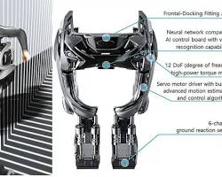

## 🚀 Visão Computacional para Todos (e para Robôs Também!)

### Descrição

Sabe quando você entra num lugar novo e fica meio perdido, sem saber onde está cada coisa? Pois é, essa é a realidade de muita gente com deficiência visual todos os dias. E se a gente pudesse usar a tecnologia pra mudar isso? 🤔

Este projeto é tipo um "olho" tecnológico que usa Inteligência Artificial pra descrever o mundo ao seu redor. Ele pega uma imagem e diz o que vê nela: "Tem uma cadeira à esquerda, a uns 2 metros", "Ali na frente tem uma porta", saca? Isso pode ajudar MUITO pessoas com deficiência visual a se guiarem por aí com mais independência e segurança. 🤩

### Benefícios e Aplicações

Mas não é só pra isso que serve essa mágica da IA! Imagina um carro que dirige sozinho e entende tudo que está acontecendo na rua: pedestres, placas, outros carros... É a mesma ideia! E dá pra usar isso em várias outras coisas:

* **Robôs:** Pra navegar em ambientes complexos, tipo um armazém cheio de caixas.
* **Segurança:** Pra identificar pessoas ou objetos suspeitos em tempo real.
* **Medicina:** Pra analisar exames e ajudar os médicos a fazer diagnósticos mais precisos.
* **Agricultura:** Pra monitorar plantações e identificar pragas ou doenças.
* **Indústria:** Para automação de processos e controle de qualidade.

A lista é grande e só tende a crescer! A capacidade de "enxergar" o mundo com IA abre um mundo de possibilidades pra facilitar a vida das pessoas e otimizar processos em diversos setores.

### Como Contribuir

Sinta-se à vontade para contribuir com este projeto! Se você tiver alguma ideia de como melhorar a precisão das descrições, adicionar novas funcionalidades ou até mesmo traduzir para outros idiomas, sua ajuda será muito bem-vinda!

### O Futuro na cabeça das pessoas!!

### Executando o Projeto no Google Colab

Você pode executar este projeto facilmente no Google Colab, um ambiente online que permite executar código Python no seu navegador.

**Link para o Colab:**
[Link para o Google Colab](https://colab.research.google.com/)

**Instruções de Execução:**

1.  **Abra o link do Colab:** Clique no link acima para abrir o notebook do projeto no Google Colab.
2.  **Faça uma cópia:** No Colab, vá em "Arquivo" > "Salvar uma cópia no Drive" para criar uma cópia do projeto na sua própria conta do Google Drive.
3.  **Obtenha sua API Key do Google AI Studio:**
    * Acesse o [Google AI Studio](https://makersuite.google.com/).
    * Crie um projeto e, em seguida, uma chave de API.
4.  **Adicione a API Key no Colab:**
    * No Colab, na barra lateral esquerda, clique no ícone de "Segredos" (o cadeado).
    * Clique em "+ Adicionar segredo".
    * No campo "Nome", digite `GEMINI_API_KEY`.
    * No campo "Valor", cole a chave de API que você criou no Google AI Studio.
    * Clique em "Salvar".
5.  **Execute o código:** Execute as células do Colab em sequência (clicando no botão "Play" de cada célula) para carregar a imagem, processá-la com o modelo Gemini e ver a descrição.
